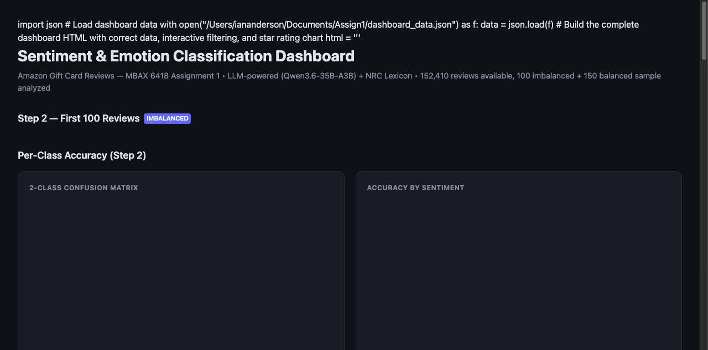

# MBAX 6418 — Assignment 1: Sentiment & Emotion Classification of Amazon Reviews

LLM-powered sentiment classification and emotion analysis of Amazon Gift Card reviews, with a self-contained interactive dashboard.

## Data

**Source:** McAuley Lab, Amazon 2023 — "Gift Cards" review category
- **File:** `Gift_Cards.jsonl.gz`
- **URL:** `https://mcauleylab.ucsd.edu/public_datasets/data/amazon_2023/raw/review_categories/Gift_Cards.jsonl.gz`
- **Total reviews:** 152,410 (verified by JSON parsing)

Each review contains: `title`, `text`, `rating` (1.0–5.0), `category`, `timestamp`, etc.

## Project Structure

```
Assign1/
├── Gift_Cards.jsonl.gz              # Raw dataset (152,410 reviews)
├── sentiment.py                     # Step 1, 2, 6 — Sentiment classification
├── emotions.py                      # Step 5 — Emotion detection (LLM + NRC)
├── complete_emotions.py             # Helper: completes partial LLM runs
├── dashboard.html                   # Step 3/4 — Interactive visualization dashboard
├── dashboard_screenshot.png         # Dashboard screenshot for README
├── README.md                        # This file
│
├── first_100_results.jsonl          # Step 2 output: 100 reviews scored
├── balanced_3class_results.jsonl    # Step 6 output: 150 balanced reviews (3-class)
├── balanced_3class_emotions.jsonl   # Step 5 output: emotions for balanced set
│
├── NRC-Lexicon/                     # NRC Word-Emotion Lexicon v0.92
│   └── NRC-Emotion-Lexicon/
│       └── NRC-Emotion-Lexicon-Wordlevel-v0.92.txt
└── requirements.txt                 # Python dependencies
```

## LLM Endpoint

- **URL:** `http://dobolyi.com:9001/v1`
- **Model:** `cyankiwi/Qwen3.6-35B-A3B-AWQ-4bit`
- **Important:** This model outputs reasoning text to the `reasoning` field (not `content`), and requires `max_tokens=2000` to complete. Parsers scan from the **end** of the reasoning to extract the final classification/emotion label.

## How to Run

### 1. Dependencies

```bash
pip install openai
```

### 2. Step 1 & 2 — Sentiment Classification (100 reviews)

```bash
python sentiment.py --first 100 --output first_100_results.jsonl
```

### 3. Step 6 — Balanced 3-Class Classification (150 reviews)

```bash
python sentiment.py --balanced --output balanced_3class_results.jsonl
```

### 4. Step 5 — Emotion Detection

```bash
# NRC lexicon-based (fast, no LLM calls)
python emotions.py --input balanced_3class_results.jsonl --method nrc --output balanced_3class_emotions.jsonl

# LLM-based (requires endpoint)
python emotions.py --input balanced_3class_results.jsonl --method llm --output balanced_3class_emotions.jsonl

# Both methods combined
python emotions.py --input balanced_3class_results.jsonl --method both --output balanced_3class_emotions.jsonl
```

### 5. Step 3/4 — Dashboard

Open `dashboard.html` in any browser. Fully self-contained — no server or network needed.

## Results Summary

### Step 2 — 100 Reviews (First 100 in File Order)

| Metric | Value |
|--------|-------|
| Accuracy | **83.0%** |
| True Positives (POS→POS) | 77 |
| True Negatives (NEG→NEG) | 6 |
| False Positives (NEG→POS) | 1 |
| False Negatives (POS→NEG) | 16 |
| POSITIVE accuracy | 82.8% (77/93) |
| NEGATIVE accuracy | 85.7% (6/7) |

**Key Finding:** The model achieves 83% accuracy on the raw sample, but this sample is heavily biased toward POSITIVE reviews (93% are 5-star). The model effectively defaults to POSITIVE, so the high accuracy is misleading.

### Step 6 — 150 Reviews (Balanced 3-Class)

| Metric | Value |
|--------|-------|
| Accuracy | **69.3%** |
| Sample Distribution | 50 POS / 50 NEG / 50 NEUTRAL |

| Class | True Count | Predicted | Accuracy |
|-------|-----------|-----------|----------|
| POSITIVE | 47 | 48 | **57%** (27/47) |
| NEGATIVE | 53 | 53 | **41%** (22/53) |
| NEUTRAL | 50 | 49 | **20%** (10/50) |

**Confusion Matrix:**
```
                Predicted
                POS   NEG   NEU
Actual POS      27     3     2
Actual NEG       0    22     2
Actual NEUT      6    30     10
```

**Key Findings:**
- **NEUTRAL is the hardest class** — only 20% accuracy. The model conflates neutral reviews with negative ones (30 of 50 neutral reviews were misclassified as NEGATIVE).
- **3-class degrades performance:** Adding NEUTRAL as a class drops accuracy by 14 percentage points from the 2-class result, even on a balanced sample.
- The model is overly aggressive in predicting NEGATIVE — it predicts NEGATIVE 53 times when the true distribution is only 53 NEGATIVE, but 30 of those are false negatives from neutral reviews.

### Step 5 — Emotion Detection

| Method | Top Emotions |
|--------|-------------|
| LLM | Anger (66), Joy (50), Trust (10), Disgust (10) |
| NRC Lexicon | Anticipation (79), Anger (13), Joy (12), Trust (7) |
| Cross-Method Agreement | **10%** (15/150) |

**Key Findings:**
- The LLM heavily clusters around **anger** and **joy**, reflecting the polarized nature of the Amazon reviews.
- The NRC lexicon heavily favors **anticipation** (a generic, high-frequency English word), producing a very different distribution.
- Only 10% agreement between methods, highlighting the fundamental difference between context-aware LLM reasoning and word-list matching.
- Emotion distributions vary significantly by true sentiment: POSITIVE reviews predict joy 45/50 times, while NEUTRAL reviews show the most diverse emotion spread.

## Dashboard

The self-contained interactive dashboard (`dashboard.html`) includes:
- **Headline metrics** for both the 100-review and 150-review samples
- **Confusion matrices** for 2-class and 3-class tasks
- **Per-class accuracy bars** and error-type doughnut charts
- **Star rating distribution** and sentiment-by-star visualization
- **Emotion detection results** with LLM vs. NRC comparison and emotion-by-sentiment breakdown
- **Interactive per-review table** with filters for sentiment, correctness, emotion, and star rating


*Dashboard screenshot showing headline metrics, confusion matrices, and emotion detection results.*

## Design Decisions

1. **Prompt engineering:** Used structured prompts with clear rules and few-shot examples to guide the model's chain-of-thought toward a single-word classification.

2. **Reasoning field parsing:** Since the model outputs to `reasoning` (not `content`), parsers scan the output from the **end** to find the final classification/emotion label. Initial runs (before fix) found labels early in the reasoning chain, producing 100% POSITIVE output — corrected by scanning from the end.

3. **Balanced sampling:** For the 3-class task, used a stratified sample (50 per class) rather than taking the first N reviews, to ensure NEUTRAL reviews are represented.

4. **NRC Lexicon:** Used the NRC Word-Emotion Lexicon v0.92 (14,154 words × 8 emotions) for the word-list approach. Excluded `positive`/`negative` columns as they are sentiment labels, not emotions.

5. **LLM timeout handling:** The Qwen3.6 model times out after ~420s for batches of ~60 reviews. Used batch processing with `batch_size=10` and a completion helper script (`complete_emotions.py`) for partial runs.

## Notes & Limitations

- The LLM endpoint has rate limits (~10 min per 100 reviews with 180s timeout per request).
- The 100-review sample (Step 2) is the **first 100 in file order**, which is biased toward positive reviews. Results are not representative of the full dataset.
- The NRC lexicon approach has inherent limitations: word-level matching ignores context, negation, and sarcasm.
- The LLM emotion detection heavily clusters around anger/joy, possibly reflecting the model's training data patterns rather than true emotion distributions.
- Cross-method agreement of 10% is low but expected given the fundamentally different approaches.
